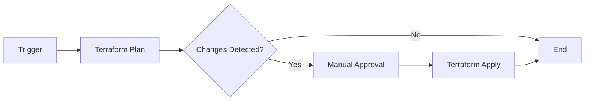
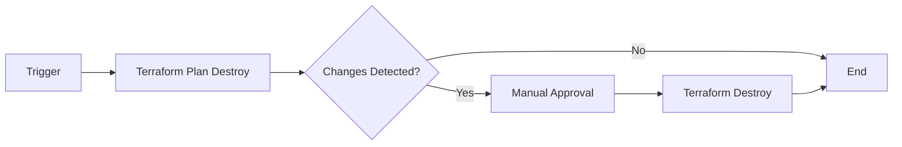
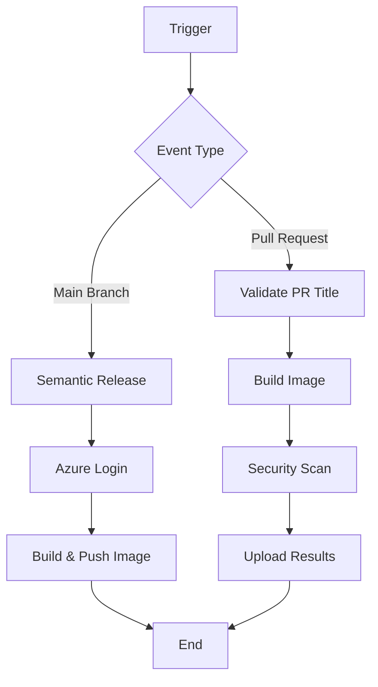
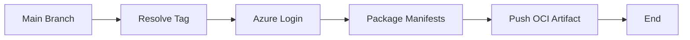

<div align="center">

# 🚀 Pipeline Templates

### Reusable GitHub Actions Workflows for Azure Infrastructure & Container Deployments

[](https://github.com/features/actions)
[](https://www.terraform.io/)
[](https://www.docker.com/)
[](https://azure.microsoft.com/)

**Production-ready workflows for Terraform automation, container builds, and Kubernetes manifest management**

[Features](#-features) • [Workflows](#-workflows) • [Quick Start](#-quick-start) • [Examples](#-usage-examples) • [Contributing](#-contributing)

</div>

---

## 📋 Table of Contents

- [✨ Features](#-features)
- [🔧 Workflows](#-workflows)
  - [Terraform Reusable Workflow](#1-terraform-reusable-workflow)
  - [Terraform Destroy Workflow](#2-terraform-destroy-workflow)
  - [Container Build & Push Workflow](#3-container-build--push-workflow)
  - [OCI Manifest Push Workflow](#4-oci-manifest-push-workflow)
- [🚀 Quick Start](#-quick-start)
- [📚 Usage Examples](#-usage-examples)
- [🔐 Security](#-security)
- [📋 Prerequisites](#-prerequisites)
- [🤝 Contributing](#-contributing)
- [📄 License](#-license)

---

## ✨ Features

<table>
<tr>
<td width="50%">

### 🏗️ Infrastructure as Code
- ✅ Automated Terraform planning & applying
- ✅ Azure backend state management
- ✅ Manual approval gates for production
- ✅ Format validation & automated checks
- ✅ Safe infrastructure destruction

</td>
<td width="50%">

### 🐳 Container Automation
- ✅ Multi-architecture Docker builds
- ✅ Semantic versioning with auto-releases
- ✅ Security scanning with Trivy
- ✅ Azure Container Registry integration
- ✅ OCI artifact support for K8s manifests

</td>
</tr>
</table>

---

## 🔧 Workflows

### 1️⃣ Terraform Reusable Workflow

**File:** `.github/workflows/terraform-reusable.yml`

A comprehensive workflow for managing infrastructure with Terraform, featuring automated planning, manual approval gates, and secure Azure authentication.

<details>
<summary>📖 <b>Click to expand details</b></summary>

#### 🎯 Purpose
Automate Terraform infrastructure deployment with safety controls and Azure integration.

#### 📊 Workflow Diagram


#### 🔑 Key Features
- **Automated Planning**: Validates and plans infrastructure changes
- **Format Checking**: Ensures Terraform code follows best practices
- **Manual Approval**: Requires human approval before applying changes
- **State Management**: Uses Azure Storage for remote state
- **OIDC Authentication**: Secure Azure authentication without static credentials

#### 📥 Inputs

| Input | Required | Default | Description |
|-------|----------|---------|-------------|
| `terraform_directory` | ✅ | `.` | Path to Terraform configuration |
| `terraform_version` | ❌ | `latest` | Terraform CLI version |
| `args` | ❌ | `""` | Extra arguments for terraform plan |
| `environment_name` | ❌ | `Production` | GitHub environment for approval |
| `backend_state_file` | ❌ | - | Custom state file name |

#### 🔒 Secrets

| Secret | Required | Description |
|--------|----------|-------------|
| `AZURE_CLIENT_ID` | ✅ | Azure service principal client ID |
| `AZURE_TENANT_ID` | ✅ | Azure AD tenant ID |
| `AZURE_SUBSCRIPTION_ID` | ✅ | Target Azure subscription ID |
| `AZURE_BACKEND_RESOURCE_GROUP` | ✅ | Resource group for state storage |
| `AZURE_BACKEND_STORAGE_ACCOUNT` | ✅ | Storage account for state |
| `AZURE_BACKEND_CONTAINER` | ✅ | Blob container for state files |
| `REPO_PAT` | ❌ | PAT for ArgoCD repo access |

#### 🎬 Jobs Flow
1. **Terraform Plan** - Validates, formats, and plans changes
2. **Manual Approval** - Awaits human approval (only on main branch with changes)
3. **Terraform Apply** - Applies approved changes

</details>

---

### 2️⃣ Terraform Destroy Workflow

**File:** `.github/workflows/terraform-destroy.yml`

Safely destroy Terraform-managed infrastructure with the same safety controls as deployment.

<details>
<summary>📖 <b>Click to expand details</b></summary>

#### 🎯 Purpose
Provide a controlled way to tear down infrastructure with approval gates.

#### 📊 Workflow Diagram


#### 🔑 Key Features
- **Safe Destruction**: Plans destroy operation before executing
- **Manual Approval**: Requires approval before destroying resources
- **State Preservation**: Maintains state file throughout process
- **Same Inputs/Secrets**: Uses identical configuration as apply workflow

#### 📥 Inputs & Secrets
Same as [Terraform Reusable Workflow](#1-terraform-reusable-workflow)

</details>

---

### 3️⃣ Container Build & Push Workflow

**File:** `.github/workflows/container-workflow.yml`

Build, scan, version, and push Docker images with automated semantic versioning and security scanning.

<details>
<summary>📖 <b>Click to expand details</b></summary>

#### 🎯 Purpose
Automate Docker image lifecycle from build to registry with security checks and semantic versioning.

#### 📊 Workflow Diagram


#### 🔑 Key Features
- **Semantic Versioning**: Automatic version bumping based on conventional commits
- **Security Scanning**: Trivy vulnerability scanning on PRs
- **Multi-Tag Strategy**: Generates semantic version, SHA, and branch tags
- **PR Validation**: Ensures PR titles follow conventional commit format
- **Vulnerability Reports**: Posts scan results as PR comments

#### 📥 Inputs

| Input | Required | Default | Description |
|-------|----------|---------|-------------|
| `context` | ❌ | `.` | Build context path |
| `dockerfile` | ✅ | - | Path to Dockerfile |
| `image_name` | ✅ | - | Container image name |
| `registry_name` | ✅ | - | Azure Container Registry name |
| `release_branch` | ❌ | `main` | Branch triggering releases |
| `vulnerability_threshold` | ❌ | `HIGH,CRITICAL` | Severity levels to fail on |
| `environment_name` | ❌ | `Production` | GitHub environment name |

#### 🔒 Secrets

| Secret | Required | Description |
|--------|----------|-------------|
| `AZURE_CLIENT_ID` | ✅ | Azure service principal client ID |
| `AZURE_TENANT_ID` | ✅ | Azure AD tenant ID |
| `AZURE_SUBSCRIPTION_ID` | ✅ | Azure subscription ID |
| `REPO_PAT` | ✅ | Personal access token for releases |

#### 📦 Outputs

| Output | Description |
|--------|-------------|
| `release_version` | Semantic version assigned |
| `release_published` | Whether a release was created |
| `image_digest` | Docker image digest |

#### 🔒 Security Features
- **Trivy Scanning**: Scans for OS and library vulnerabilities
- **Configurable Thresholds**: Fail builds based on severity
- **SARIF Reports**: Structured vulnerability reporting
- **PR Comments**: Automated security summaries

</details>

---

### 4️⃣ OCI Manifest Push Workflow

**File:** `.github/workflows/oci-push.yml`

Package and push Kubernetes manifests as OCI artifacts to Azure Container Registry.

<details>
<summary>📖 <b>Click to expand details</b></summary>

#### 🎯 Purpose
Version and distribute Kubernetes manifests using OCI artifact standards.

#### 📊 Workflow Diagram


#### 🔑 Key Features
- **OCI Compliance**: Uses OCI artifact specification
- **Automatic Tagging**: Uses commit SHA for versioning
- **Tarball Packaging**: Compresses manifests efficiently
- **ORAS Integration**: Uses ORAS CLI for OCI operations

#### 📥 Inputs

| Input | Required | Default | Description |
|-------|----------|---------|-------------|
| `manifest_directory` | ❌ | `Kubernetes` | Directory containing manifests |
| `artifact_name` | ✅ | - | OCI repository name |
| `registry_name` | ✅ | - | Azure Container Registry name |
| `environment_name` | ❌ | `Production` | GitHub environment name |

#### 🔒 Secrets

| Secret | Required | Description |
|--------|----------|-------------|
| `AZURE_CLIENT_ID` | ✅ | Azure service principal client ID |
| `AZURE_TENANT_ID` | ✅ | Azure AD tenant ID |
| `AZURE_SUBSCRIPTION_ID` | ✅ | Azure subscription ID |

#### 📦 Outputs

| Output | Description |
|--------|-------------|
| `artifact_tag` | Generated artifact tag (commit SHA) |

</details>

---

## 🚀 Quick Start

### Step 1: Reference the Workflow

Add a workflow file to your repository (e.g., `.github/workflows/deploy.yml`):

```yaml
name: Deploy Infrastructure

on:
  push:
    branches: [main]
  pull_request:

jobs:
  terraform:
    uses: amirpouyan-haghighat/Pipeline-Templates/.github/workflows/terraform-reusable.yml@main
    with:
      terraform_directory: "./infrastructure"
      terraform_version: "1.6.0"
      environment_name: "Production"
    secrets:
      AZURE_CLIENT_ID: ${{ secrets.AZURE_CLIENT_ID }}
      AZURE_TENANT_ID: ${{ secrets.AZURE_TENANT_ID }}
      AZURE_SUBSCRIPTION_ID: ${{ secrets.AZURE_SUBSCRIPTION_ID }}
      AZURE_BACKEND_RESOURCE_GROUP: ${{ secrets.AZURE_BACKEND_RESOURCE_GROUP }}
      AZURE_BACKEND_STORAGE_ACCOUNT: ${{ secrets.AZURE_BACKEND_STORAGE_ACCOUNT }}
      AZURE_BACKEND_CONTAINER: ${{ secrets.AZURE_BACKEND_CONTAINER }}
```

### Step 2: Configure Secrets

Add required secrets to your repository:
1. Go to **Settings** → **Secrets and variables** → **Actions**
2. Add the required secrets for your chosen workflow

### Step 3: Configure Environment (Optional)

For production deployments with approval gates:
1. Go to **Settings** → **Environments**
2. Create environment (e.g., "Production")
3. Add required reviewers

---

## 📚 Usage Examples

### Example 1: Terraform Deployment

```yaml
name: Infrastructure Deployment

on:
  push:
    branches: [main]
  pull_request:

jobs:
  deploy:
    uses: amirpouyan-haghighat/Pipeline-Templates/.github/workflows/terraform-reusable.yml@main
    with:
      terraform_directory: "./terraform"
      terraform_version: "1.6.0"
      args: "-var-file=production.tfvars"
      environment_name: "Production"
    secrets: inherit
```

### Example 2: Container Build with Security Scanning

```yaml
name: Build and Push Container

on:
  push:
    branches: [main]
  pull_request:

jobs:
  build:
    uses: amirpouyan-haghighat/Pipeline-Templates/.github/workflows/container-workflow.yml@main
    with:
      dockerfile: "Dockerfile"
      image_name: "my-app"
      registry_name: "myacr"
      vulnerability_threshold: "CRITICAL"
    secrets:
      AZURE_CLIENT_ID: ${{ secrets.AZURE_CLIENT_ID }}
      AZURE_TENANT_ID: ${{ secrets.AZURE_TENANT_ID }}
      AZURE_SUBSCRIPTION_ID: ${{ secrets.AZURE_SUBSCRIPTION_ID }}
      REPO_PAT: ${{ secrets.GITHUB_TOKEN }}
```

### Example 3: Deploy Kubernetes Manifests as OCI

```yaml
name: Push K8s Manifests

on:
  push:
    branches: [main]

jobs:
  push-manifests:
    uses: amirpouyan-haghighat/Pipeline-Templates/.github/workflows/oci-push.yml@main
    with:
      manifest_directory: "k8s"
      artifact_name: "my-app-manifests"
      registry_name: "myacr"
    secrets: inherit
```

### Example 4: Infrastructure Teardown

```yaml
name: Destroy Infrastructure

on:
  workflow_dispatch: # Manual trigger only

jobs:
  destroy:
    uses: amirpouyan-haghighat/Pipeline-Templates/.github/workflows/terraform-destroy.yml@main
    with:
      terraform_directory: "./terraform"
      environment_name: "Production"
    secrets: inherit
```

---

## 🔐 Security

### Best Practices

- ✅ **Use OIDC Authentication**: Workflows use OpenID Connect for Azure authentication
- ✅ **Secret Management**: Never commit secrets to your repository
- ✅ **Least Privilege**: Grant minimum required permissions to service principals
- ✅ **Vulnerability Scanning**: Containers are scanned with Trivy before deployment
- ✅ **Manual Approvals**: Production changes require human approval
- ✅ **Conventional Commits**: PR titles must follow conventional commit format

### Security Scanning

The container workflow includes Trivy security scanning that:
- Scans for OS and library vulnerabilities
- Reports findings in SARIF format
- Posts summaries to pull requests
- Fails builds based on configurable thresholds

---

## 📋 Prerequisites

### Azure Setup

1. **Azure Subscription**: Active Azure subscription
2. **Service Principal**: Create service principal with required permissions:
   ```bash
   az ad sp create-for-rbac \
     --name "github-actions" \
     --role contributor \
     --scopes /subscriptions/{subscription-id}
   ```
3. **Storage Account**: For Terraform state (if using Terraform workflows)
4. **Container Registry**: Azure Container Registry (if using container workflows)

### GitHub Configuration

1. **Environments**: Configure protection rules and reviewers
2. **Secrets**: Add required Azure credentials and tokens
3. **Permissions**: Ensure workflows have necessary permissions

### Tools & Versions

- **Terraform**: Latest or specified version
- **Docker**: For container workflows
- **ORAS**: Automatically installed for OCI workflows
- **Trivy**: Automatically installed for security scanning

---

## 🤝 Contributing

We welcome contributions! Here's how you can help:

### Conventional Commits

This project uses [Conventional Commits](https://www.conventionalcommits.org/):

```
feat: add new workflow for Azure Functions
fix: correct terraform state file naming
docs: update README with new examples
chore: update dependencies
```

### Pull Request Process

1. **Fork** the repository
2. **Create** a feature branch (`git checkout -b feature/amazing-feature`)
3. **Commit** changes using conventional commits
4. **Push** to your branch (`git push origin feature/amazing-feature`)
5. **Open** a Pull Request

### Reporting Issues

Found a bug or have a feature request? [Open an issue](../../issues/new)!

---

## 📄 License

This project is open source and available for use in your projects.

---

<div align="center">

### 🌟 Found this helpful? Give it a star!

**Made with ❤️ for the DevOps community**

[Report Bug](../../issues) · [Request Feature](../../issues) · [Discussions](../../discussions)

</div>
